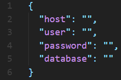

  

  

31 of January of 2019

Faculdade de Ciências da Universidade de Lisboa

# Introduction

This manual explains how to install and configure the system so that all
applications work correctly. This installation guide was designed for a
server running the **Ubuntu 18.04** operating system.

# Requirements

  - Back-end server and web applications source code

  - SSL certificate (only if you want to serve the applications with
    HTTPS)

  - Access to the server

  - Sudo privileges

# Installation

This section explains step by step how to install all the necessary
tools and how to configure them. Most of the next steps are done in the
command line.

## Apache

Apache is the http server used to serve the web applications. Follow the
next steps for information on how to install and configure it:

1.  Install Apache2 - **sudo apt install apache2**

2.  Enable Apache2 mods - **sudo a2enmod rewrite proxy proxy\_http**

3.  Configure Apache default site file
    
    1.  Go to **/etc/apache2/sites-enabled/**
    
    2.  Open the **000-default.conf** file with **sudo** privileges
    
    3.  Add the configuration shown in figure
        [\[fig:apache\_config\]](#fig:apache_config)
    
    4.  Save the file and exit

4.  Restart Apache2 service - **sudo service apache2 restart**

5.  Verify that Apache2 is running - **sudo service apache2 status**

\[fig:apache\_config\]

## PHP 7

PHP 7 is necessary to run the Examinator (accessibility evaluator).
Follow the next steps to install PHP and all the necessary modules:

1.  Add the PHP 7 repository - **sudo add-apt-repository
    ppa:ondrej/php**

2.  Update system repositories - **sudo apt update**

3.  Install PHP 7 - **sudo apt install php7.2**

4.  Install PHP 7 modules - **sudo apt install php-pear php7.2-curl
    php7.2-dev php7.2-gd php7.2-mbstring php7.2-zip php7.2-mysql
    php7.2-xml**

5.  Verify that PHP is installed correctly - **php -v**

## Node.Js

Node.Js is necessary to run the back-end server with the available
web-services and communication with the database. To install Node.Js,
follow the next steps:

1.  Install curl - **sudo apt install curl**

2.  Install NVM (Node Version Manager) -**curl -o-
    https://raw.githubusercontent.com/creationix/nvm/v0.34.0/install.sh
    \(|\) bash**

3.  Restart the terminal

4.  Install Node.Js - **nvm install 8**

5.  Verify that Node.Js was correctly installed - **node -v** and **npm
    -v**

6.  Install Angular cli to build the applications - **npm install -g
    @angular/cli@6**

7.  Verify that Angular cli is correctly installed - **ng –version**

## MySQL

To install and configure the MySQL database, follow the next steps:

1.  Install MySQL Client and Server - **sudo apt install
    mysql-client-5.7 mysql-server-5.7**

2.  Open MySQL console - **sudo mysql -u root**

3.  Create a database - **CREATE SCHEMA accessmonitor DEFAULT CHARACTER
    SET utf8;**

4.  Create a new user, replacing \(<\)username\(>\) and
    \(<\)password\(>\) with the desired values - **CREATE USER
    ’\(<\)username\(>\)’@’localhost’ IDENTIFIED WITH
    mysql\_native\_password BY ’\(<\)password\(>\)’;**

5.  Grant privileges to the new user - **GRANT
    SELECT,INSERT,UPDATE,DELETE,CREATE,DROP ON accessmonitor.\* TO
    ’\(<\)username\(>\)’@’localhost’;**

6.  Select the new database - **use accessmonitor;**

7.  Copy the sql from the **db.sql** file and paste it in the console.
    This will create the database tables

8.  Logout from MySQL console and enter again with the new user account.
    Verify that the new user can access the new database
    **accessmonitor**

# Deployment

This section explains how to deploy the back-end server and all the web
applications to the server.

## Back-end server

1.  Download the back-end server source code to a temporary folder that
    does not require sudo privileges

2.  In the command line go to that folder

3.  Install dependencies - **npm install**

4.  Go to **/var/www/**

5.  Create the back-end server folder - **sudo mkdir monitor-server**

6.  Copy the back-end server source code from the temporary folder to
    the new folder

7.  Go back to **/var/www/**

8.  Create a secret key
    
    1.  Create a file and name it **secret.txt**
    
    2.  Inside it write a long random string (at least 50 characters)

9.  Create a database configuration file
    
    1.  Create a file and name it **db.json**
    
    2.  Copy the content from figure
        [\[fig:db\_config\]](#fig:db_config) to the new file
    
    3.  Fill the fields with the necessary information referent to the
        database connection. Use the same username and password that you
        created when installing MySQL. Use **accessmonitor** for the
        database name. If the MySQL server and the web server are in the
        same machine the value of host should be localhost, if not, it
        should be the address of the MySQL server.

10. Go to **/var/www/monitor-server/bin/**

11. Start the server - **nohup node www &**

\[fig:db\_config\]

## Web applications

Before copying the web applications to the new server it is necessary to
build each one of them to run in a production environment. For that
follow the next steps:

1.  Download the application source code to a temporary folder that does
    not require sudo privileges folder

2.  In the command line go to that folder

3.  Install dependencies - **npm install**

4.  If you want to serve the applications with HTTPS follow the next
    substeps
    
    1.  Open the file **(...)/src/app/services/config.service.ts**
    
    2.  Change the variable **PROTOCOL** from “http://” to “https://”,
        line 9, figure [\[fig:protocol\_https\]](#fig:protocol_https)

5.  Build the application - **ng build –prod –build-optimizer**

6.  Go to the **dist** folder

7.  Open the **index.html** file

8.  Change the attribute **href** from the **base** tag (line 3 in
    figure [\[fig:base\_href\_before\]](#fig:base_href_before)) to your
    application’s domain (figure
    [\[fig:base\_href\_after\]](#fig:base_href_after) shows an example
    with the address of the Portuguese domain)

9.  Go to **/var/www/html/**

10. Create a new folder for the application - **sudo mkdir amp**

11. Copy all the files from the application **dist** folder to the new
    created folder

12. Inside the new folder create an access file - **sudo touch
    .htaccess**

13. Copy the content from figure [\[fig:htaccess\]](#fig:htaccess) to
    the **.htaccess** file

14. Change the **RewriteBase**, line 3, to the application’s domain
    relative path

15. Repeat all the previous steps for all applications

\[fig:protocol\_https\]

\[fig:base\_href\_before\]

\[fig:base\_href\_after\]

# Admin monitor script

To create users for the applications use the Admin Monitor Suite
application. However it is not possible to create an admin user through
the same process. Instead you can create admin users with a script in
the command line. Follow the next steps to create admin users:

1.  Copy the folder **admin-monitor** to **/var/www/**

2.  Enter the folder **admin-monitor** - **cd admin-monitor**

3.  Run the script - **node admin.js**

# Testing in a development environment

If you want to test the applications before building them to a
production environment, you can run them locally with the following
steps:

1.  Go to the application root folder

2.  Serve the application - **ng serve**
    
    1.  The command above will launch the application in the port 4200
    
    2.  If the port is already in use, use the following command - **ng
        serve –port=\(<\)PORT\(>\)**

# Conclusion

At the end of the installation and deployment you should have something
like the folders in the figures
[\[fig:var\_www\_folder\]](#fig:var_www_folder) and
[\[fig:var\_www\_html\_folder\]](#fig:var_www_html_folder). All the
applications should be running at the established domain.

  - **monitor-server:** Back end server

  - **amp:** Access Monitor Plus application

  - **mm:** My Monitor application

  - **sm:** Study Monitor application

  - **observatory:** Observatory application

  - **ams:** Admin Monitor Suite application

\[fig:var\_www\_folder\]

\[fig:var\_www\_html\_folder\]
