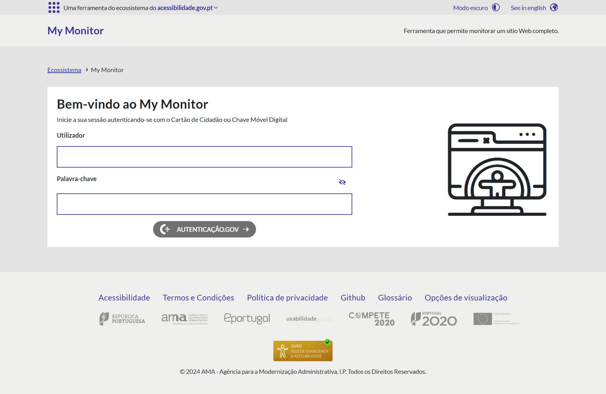
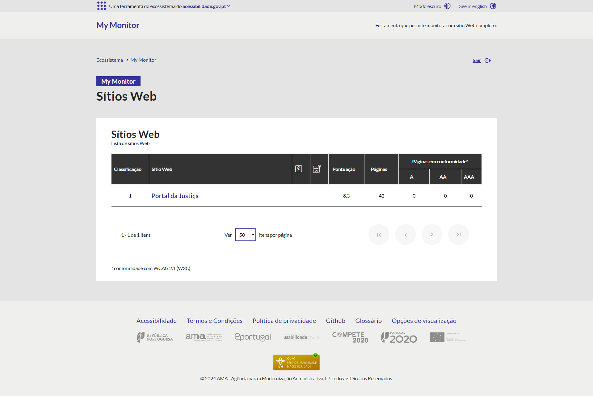
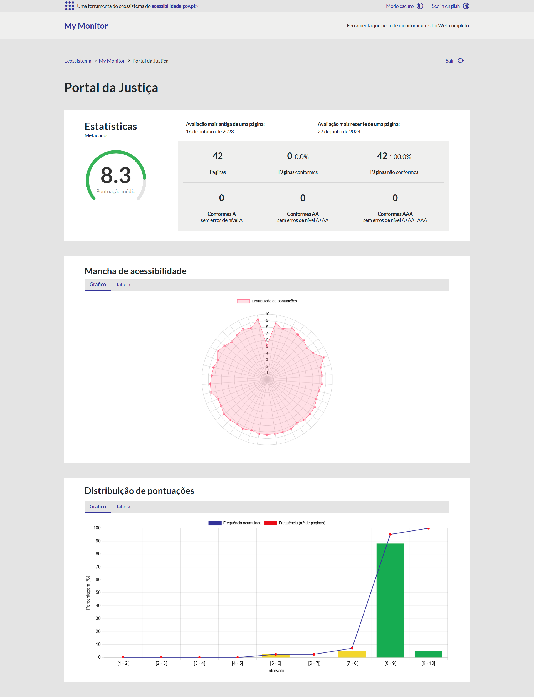
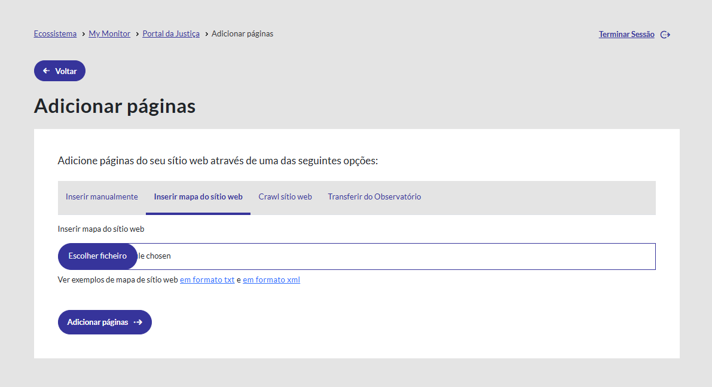
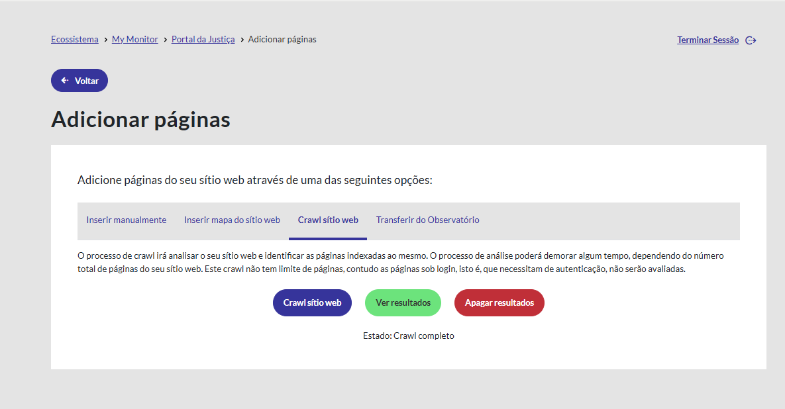
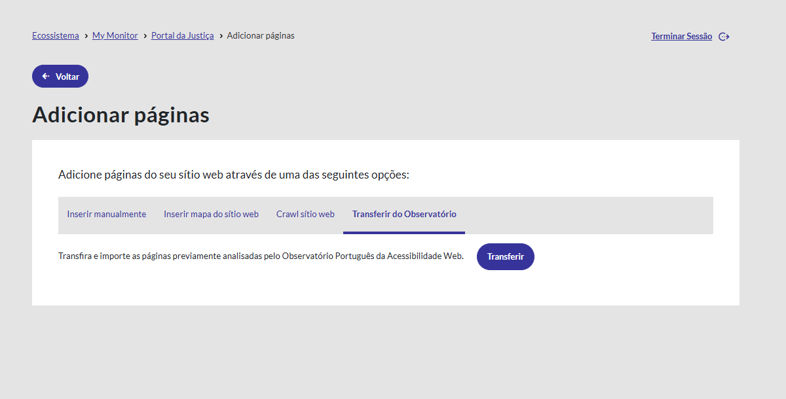
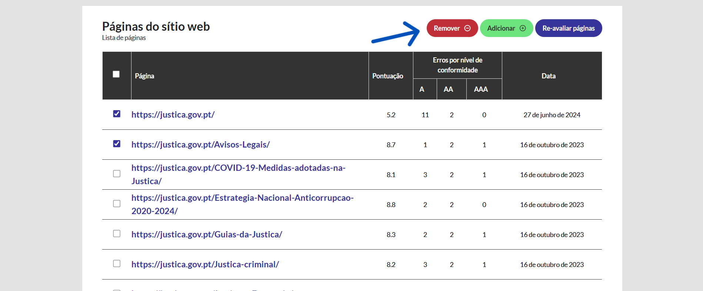
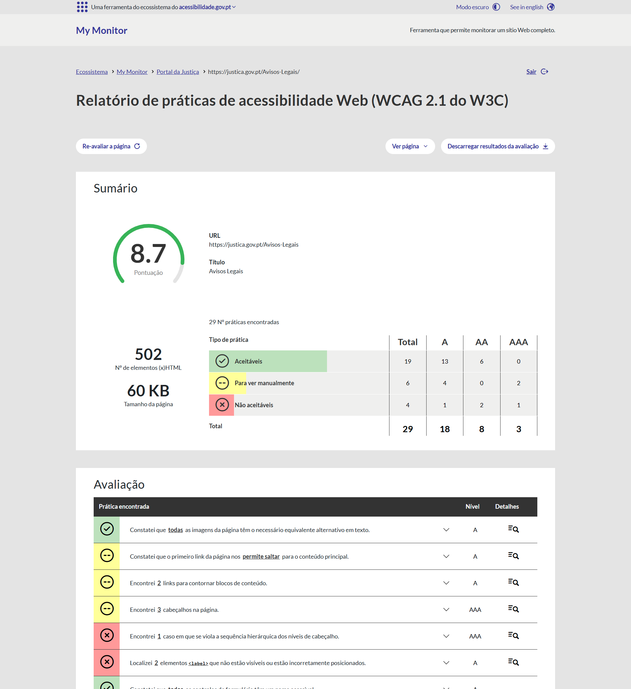

# Manual do MyMonitor

## Índice
- [Boas-vindas ao MyMonitor](#boas-vindas-ao-mymonitor)
- [O que é o MyMonitor?](#o-que-é-o-mymonitor)
- [A quem se destina](#a-quem-se-destina)
- [Pedido de credenciais de acesso](#pedido-de-credenciais-de-acesso)
- [Como utilizar o MyMonitor](#como-utilizar-o-mymonitor)
  - [Iniciar sessão no MyMonitor](#iniciar-sessão-no-mymonitor)
  - [Visualizar os sítios web](#visualizar-os-sítios-web)
  - [Aceder às estatísticas do sítio web](#aceder-às-estatísticas-do-sítio-web)
  - [Gestão de páginas no MyMonitor](#gestão-de-páginas-no-mymonitor)
  - [Adicionar páginas no MyMonitor](#adicionar-páginas-no-mymonitor)
  - [Como importar páginas do seu sítio web](#escolha-a-sua-modal-de-importação-de-páginas)
    - [Inserir manualmente](#inserir-manualmente)
    - [Inserir mapa do sítio web](#inserir-sitemap)
    - [Crawl do sítio web](#crawl-do-sítio-web)
    - [Transferir do Observatório](#transferir-do-observatório)
  - [Remover páginas no MyMonitor](#remover-páginas-no-mymonitor)
  - [Ações corretivas](#ações-corretivas)
  - [Reavaliar páginas](#reavaliar-páginas)
  - [Consultar o relatório de práticas de acessibilidade web](#consultar-o-relatório-de-práticas-de-acessibilidade-web)
- [Perguntas frequentes](#perguntas-frequentes)
- [Sugestões](#sugestões)

## 📢 Boas-vindas ao MyMonitor

Bem-vindo ao **MyMonitor**, a plataforma desenvolvida pela **Agência para a Modernização Administrativa (AMA)** para monitorizar e melhorar a acessibilidade dos websites, também denominados sítios web, das entidades públicas em Portugal. Com o MyMonitor, pode analisar diversas páginas de um sítio web, identificar pontos críticos de acessibilidade e promover um ambiente digital mais inclusivo para todos.

## 🔍 O que é o MyMonitor?

O **MyMonitor** é uma plataforma inovadora baseada no motor de avaliação do **AccessMonitor** que tem como objetivo apoiar as entidades públicas no cumprimento das **Diretrizes de Acessibilidade para Conteúdos Web (WCAG)**, garantindo uma experiência digital mais inclusiva para todos os cidadãos.

As suas principais funcionalidades incluem:
- A visualização da **"mancha de acessibilidade"**, um mapa que destaca visualmente as áreas mais críticas de um sítio web e que precisam de intervenção;
- A **gestão ativa de avaliações**, possibilitando a adição ou remoção de páginas monitorizadas e a solicitação de novas análises após a implementação de melhorias;
- A **importação flexível de páginas**. O MyMonitor oferece várias opções para importar páginas a serem avaliadas: inserção manual de URLs, carregamento de ficheiro com endereços de páginas, importação de sitemap em formato XML e transferência de páginas já analisadas pelo Observatório da Acessibilidade Web;
- **Elaboração de relatórios** com gráficos e tabelas detalhados.

## A quem se destina

O acesso ao **MyMonitor** é destinado exclusivamente aos **responsáveis dos sites** e **profissionais autorizados**.

## Pedido de credenciais de acesso

Para aceder à plataforma MyMonitor, é necessário solicitar previamente as credenciais de acesso. Este pedido deve ser realizado exclusivamente pelo **proprietário do site** e requer a utilização do **Cartão de Cidadão** ou da **Chave Móvel Digital**.

Leia com atenção as seguintes instruções e siga os passos indicados:

**Passo 1 – Envie um e-mail à AMA**

Envie um e-mail para **acessibilidade@ama.gov.pt**, com os seguintes dados:
- **Nome da Entidade Proprietária**:
- **Nome da pessoa responsável na entidade**:
- **Contacto**: telefone / e-mail institucional;
- **Sítio(s) Web a registar no MyMonitor**:
  - **Endereço (URL)**:
  - **Designação**:

**Passo 2 – Aguarde o contacto por parte da AMA**

A AMA recebeu o seu pedido e entrará em contacto no prazo máximo de **24 horas**. Certifique-se que tem consigo o **Cartão de Cidadão** (ou **Chave Móvel Digital**) de todas as pessoas que necessitarão de acesso à plataforma.

**Passo 3 – Aceda à plataforma MyMonitor**

Assim que receber as credenciais da AMA, poderá aceder ao MyMonitor utilizando o seu **Cartão de Cidadão** ou a **Chave Móvel Digital**, através do portal indicado.

## Como utilizar o MyMonitor

### Iniciar sessão no MyMonitor

Visite o site oficial do MyMonitor e faça login com as suas credenciais, nomeadamente utilizador e palavra-chave.

### Visualizar os sítios web

Na página inicial, verá uma lista de todos os seus **sítios web** com informações relevantes como o **nome da página**, **pontuação do AccessMonitor**, **declaração de acessibilidade**, **selo de acessibilidade e usabilidade** e **número de páginas** segundo os níveis de conformidade das WCAG, sendo **A** (o nível mais baixo), **AA** (nível intermédio) e **AAA** (o mais alto). Clique no nome do sítio web para aceder aos seus dados.

### Aceder às estatísticas do sítio web

Ao clicar no nome de um sítio web na tabela de sítios web, será apresentada a sua página com as **estatísticas detalhadas**.

Estas estatísticas incluem:
- A **pontuação média** segundo o índice AccessMonitor (de 1 a 10);
- A **“mancha de acessibilidade”**;
- Os **gráficos de distribuição de pontuações**;
- As **10 melhores e piores práticas de acessibilidade** presentes no seu sítio web e a sua distribuição detalhada;
- A **tabela da lista de páginas totais** que compõem o seu sítio web.

## Gestão de páginas no MyMonitor

### Adicionar páginas no MyMonitor

Para adicionar uma nova página ao seu sítio web, clique no seu sítio web e percorra a página das estatísticas até à secção mais perto do final da página designada por “Páginas do sítio web” onde aparece a lista total de páginas.

De seguida clique no botão "Adicionar" como ilustrado na imagem abaixo para incluir novas páginas. Será redirecionado para uma nova página.  

### Escolha uma das quatro opções para importar as páginas do seu sítio web
Esta página dispõe de quatro opções para a importação das páginas a avaliar.  

Ao clicar no botão “Adicionar”, será redirecionado para uma página com 4 abas. Estas abas oferecem **quatro opções** para a importação das páginas a avaliar.

Escolha uma das quatro opções de importação de páginas:

 - #### a) Inserir manualmente
    Adicione páginas inserindo os respetivos **URLs** diretamente na caixa de texto.

 - #### b) Inserir sitemap
    Importe páginas a partir de um ficheiro em formato **TXT** ou **XML**. Veja exemplos de mapa de sítios web em [formato txt](#) e [formato xml](#) ao clicar nos links para o efeito.

    

 - #### c) Crawl do sítio web
    Execute uma análise automática para identificar páginas indexadas ao seu sítio web. Este *crawl* **não tem limite de páginas**, contudo as páginas sob login que necessitem de autenticação não serão avaliadas.

    

 - #### d) Transferir do Observatório
    Transfira as páginas já analisadas pelo **Observatório Português da Acessibilidade Web**.

    
    
Neste último caso, além das páginas, também será importada a **última avaliação realizada pela AMA**, mas qualquer nova análise feita no MyMonitor será **independente da avaliação oficial do Observatório**.

### Remover páginas no MyMonitor

Para remover uma página ao seu sítio web, clique no seu sítio web e percorra a página das estatísticas até à tabela onde aparece a lista total de páginas.

De seguida, selecione a **caixa de seleção** da página que deseja remover e depois clique no botão **"Remover"** como ilustrado na imagem abaixo.

## Ações corretivas

### Reavaliar páginas

Após corrigir os erros, é recomendável fazer uma nova reavaliação das páginas.

Para isso, clique no seu sítio web e percorra a página das estatísticas até à tabela onde aparece a lista total de páginas.

Selecione a página a atualizar e clique em **“Reavaliar”** para uma nova análise.

### Consultar o relatório de práticas de acessibilidade web

Clique numa página na tabela para ver o **relatório de práticas de acessibilidade web** e sugestões de melhorias. Irá ser apresentado um **sumário de avaliação** com o tipo de práticas encontradas (“Aceitáveis”, “Para ver manualmente” e “Não aceitáveis”). A partir daí, pode:
- **Reavaliar a página** novamente;
- Ver **código da página** em “Ver página”;
- **Descarregar os resultados da avaliação** em formato **CSV**.

**Nota**: Atualmente, os relatórios só podem ser descarregados individualmente para cada página.

## Perguntas frequentes

 - **Quem pode usar o MyMonitor?**  
Responsáveis por sites das entidades e profissionais autorizados.

 - **O que distingue o MyMonitor do AccessMonitor?**  
Embora o MyMonitor utilize o mesmo motor de avaliação do AccessMonitor, o MyMonitor disponibiliza um conjunto alargado de funcionalidades que a tornam mais poderosa e eficaz. A grande vantagem do MyMonitor é a possibilidade de analisar **múltiplas páginas em simultâneo**, algo que o validador AccessMonitor não oferece. A plataforma permite aos gestores dos websites identificarem quais são as páginas que estão a comprometer a acessibilidade geral do site, facilitando a definição de prioridades para a sua melhoria.

 - **O MyMonitor corrige os erros automaticamente?**  
Não. O MyMonitor identifica problemas e sugere melhorias, mas as correções devem ser feitas pelos responsáveis e gestores dos sites.

 - **É necessário instalar algum software?**  
Não. O MyMonitor é uma plataforma **online e gratuita** acessível pelo navegador.

 - **A análise do MyMonitor substitui uma auditoria humana?**  
Não. Embora o MyMonitor automatize grande parte do processo, uma **revisão manual** é recomendada para atingir a máxima conformidade em termos de acessibilidade web.

 - **O que é a “mancha de acessibilidade”?**  
Uma das funcionalidades mais inovadoras do MyMonitor é a **"mancha de acessibilidade"**, que representa visualmente o nível de acessibilidade das páginas monitorizadas. Ela permite detetar rapidamente as páginas que fogem ao padrão e que necessitam de intervenção.

## Sugestões

Tem ideias para melhorar o **MyMonitor**? A AMA quer ouvir a sua opinião! Envie as suas sugestões para **acessibilidade@ama.gov.pt**. Juntos estamos a construir um mundo digital mais acessível para todos!
